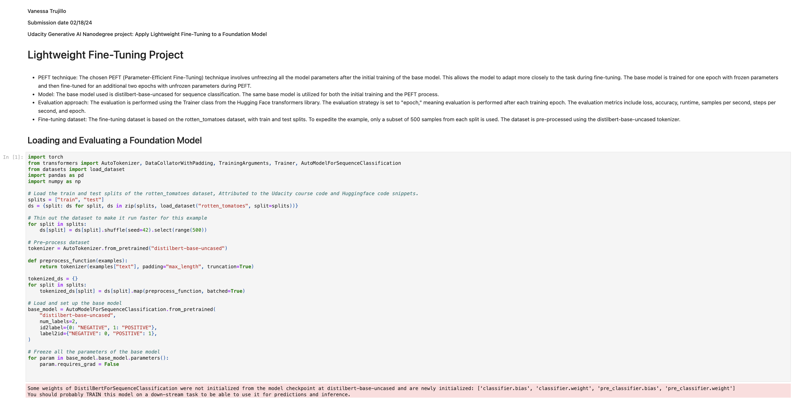
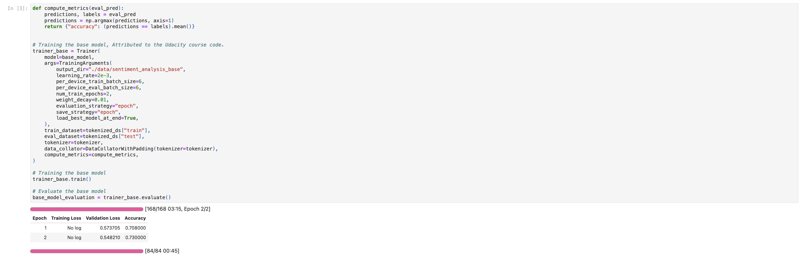
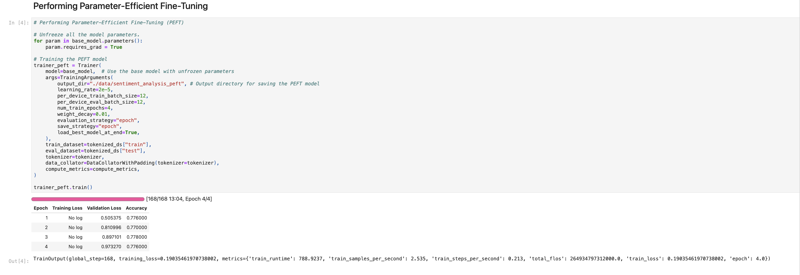
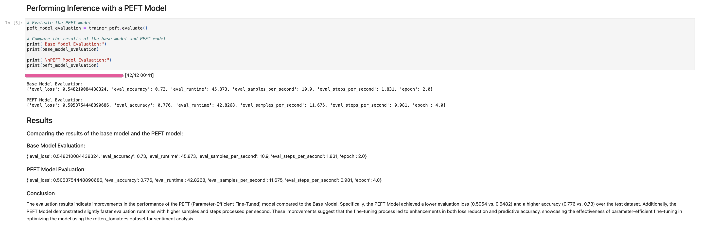

# Apply-Lightweight-Fine-Tuning-to-a-Foundation-Model
This GitHub project focuses on the application of a lightweight fine-tuning technique to enhance a foundational machine learning model. 

---

# Lightweight Fine-Tuning on a Foundation Model

## Overview

This project explores the implementation of lightweight fine-tuning techniques on a foundation machine learning model. Fine-tuning involves adjusting a pre-trained model to better fit a specific task or dataset, typically resulting in improved performance. Our focus is on achieving these enhancements in performance while minimizing computational resources and time requirements.

## Motivation

Fine-tuning pre-trained models is a common practice in machine learning, especially in scenarios where labeled data is limited or when specific task requirements differ from the original training data. However, fine-tuning can be computationally expensive and time-consuming, especially when dealing with large models and datasets. This project aims to address these challenges by investigating lightweight fine-tuning approaches that maintain efficiency without sacrificing performance.

## Features

- **Efficient Fine-Tuning**: Explore techniques for fine-tuning pre-trained models with minimal computational overhead.
- **Model Evaluation**: Evaluate the effectiveness of fine-tuning strategies through comprehensive performance analysis.
- **Resource Optimization**: Optimize resource utilization while maintaining or enhancing model performance.
- **Flexible Implementation**: Modular code structure allows for easy experimentation and extension of fine-tuning methods.

## Usage

1. **Clone the Repository**:

    ```
    git clone https://github.com/yourusername/fine-tuning-project.git
    ```

2. **Install Dependencies**:

    ```
    pip install -r requirements.txt
    ```

3. **Run Experiments**:

    ```
    python main.py
    ```

4. **Explore Results**:

    Analyze the output logs and generated metrics to assess the performance of different fine-tuning strategies.

## Contributing

Contributions are welcome! If you have ideas for improving the project or implementing new features, feel free to submit a pull request or open an issue to discuss your suggestions.

## License

This project is licensed under the MIT License - see the [LICENSE](LICENSE) file for details.

## Acknowledgements

We would like to thank the open-source community for their valuable contributions and support in developing this project.

---

Feel free to customize this README according to the specific details and goals of your project.


Project Screenshots:




